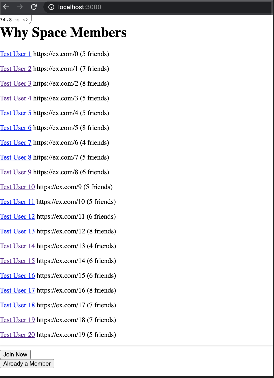
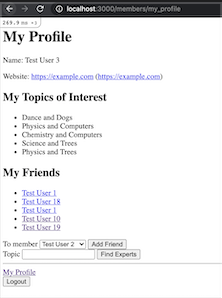

> :warning: **Quick and dirty code here**: This project is my submission to a
  [coding challenge](challenge.md). ~It was written on a strict timeline~ It was
  written with _some_ haste, but mostly I wanted to have fun. I'd be more than
  happy to discuss any part of this solution or my thoughts on the take-home
  challenge as presented to me.

# WhySpace

WhySpace is a barebones social media clone. It's a Ruby on rails project which
uses Devise for login and Bitly as a link shortener to create member profiles.

[](screenshot-home.png)

[](screenshot-profile.png)

[](screenshot-search.png)

## Installation

You will need a Bitly API key before getting started.

- Install Ruby 2.7
- Install Bundler 2.1.4
- `bundle`
- `bin/rake db:setup`
- `export BITLY_API_KEY=...`
- `bin/rails s`

There are a number of seed users which can all be accessed with

```
login: email_#{n}@example.com
password: test1234
```

## Development

I wrote this over the course of 3 days, devoting around 4-5 hours per day. I
have avoided rebasing as much as possible to keep the timestamps clear but have
also pushed separate branches to show the major milestones.

### Day 1 (scaffolding)

[website-and-topic branch](https://github.com/Sinetheta/why_space/tree/sinetheta/website-and-topic)

* Rails new
* Devise for login
* Member model to track names
* Website model to track website urls
* Passion model to track topics of interest
* Profile pages #show and #my_profile to display this info
* Piggyback on registration form to collect name and website

On day1 my suspicions were confirmed. There was zero chance I'd be completing
the challenge in the 4 hour time limit or anything close. I cut corners from
the start, but I wasn't going to have any fun breaking my back for a speed run.
So although the UI is barebones, there do exist some specs to help my process.

### Day 2 (friendship)

[sinetheta/friendships branch](https://github.com/Sinetheta/why_space/tree/sinetheta/website-and-topic)

* Friendship model to track which Members add which other Members as friends
* Project seeds
* Add Friend form on my profile
* Show friends on profile pages
* *start work on expert search

On day2 I sorted out how I wanted friends to work. I also started imagining what
an "expert search" was going to look like and played around with a couple graph
pathfinding gems.

### Day 3 (experts search)

[sinetheta/expert-search branch](https://github.com/Sinetheta/why_space/tree/sinetheta/website-and-topic)

* Friends graph
* Expert search
* Pathfinding on the graph to those experts
* Search form on my profile page
* Search results display as profile page links
* Members list page

Day 3 is when I tied it all together with the experts' search. I guess you could
complain that the only computer science in this challenge I have delegated to
someone's ancient 5 star pet project [thinkphp/dijkstra.gem](https://github.com/thinkphp/dijkstra.gem)
but I'm no CPSC phd and I'm more than happy to leave bit crunching to someone
else. My thanks to [thinkphp](https://github.com/thinkphp) for putting it out
there and wrapping it as a gem, because pickings were pretty sparse when it came
to Ruby implementations of pathfinding algorithms.

There are some other algos which might have slightly better performance
characteristics. Especially the class of solutions that connect more points
simultaneously because our problem required repeated application of Dijkstra
to get all the output I needed.

Ultimately this type of strategy would never scale. Before playing Kevin Bacon
there's no way to know if any particular person is going to be needed, so this
search is going to grow fast. Rather than try to optimize any particular search
algorithm I'd be inclined to look to a more tailor suited tool like Neo4j.
